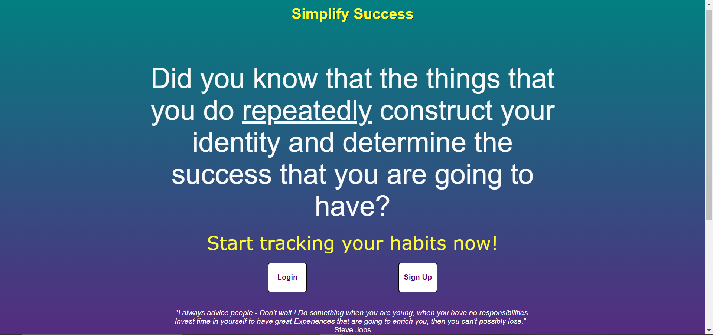
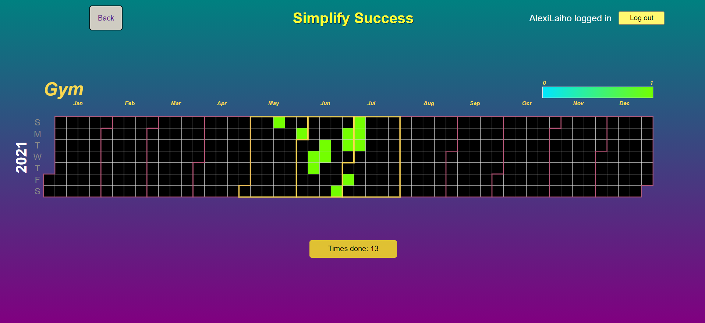

<h1>Simplify Success</h1> 

A web app project that tracks users' habits.

 <h2>Presentation Video of the App</h2>
 
  
You can view a presentation video of the app on YouTube: [Link to Video]
 
  
  
  
Users can create an account and log in.

  

    

Users can add habits and mark them completed for that day. The current streak will appear once the user has completed the habit for two or more consecutive days.
 
    
 
    

Users can navigate to a page that shows more detailed information about a given habit, such as a calendar view of completed and missed days.

  
 
 <h3>Backend</h3>
 
  
The backend is built with Node.js, Express, and TypeScript, and it uses MongoDB for data storage.
 
  
  <h3>Frontend</h3> 
  
  
The frontend is built with React and TypeScript.
 
  
  
The client side uses Cypress for End-to-End (E2E) tests. To run these tests, start the backend development server in test mode with the following command:
  
     `npm run start:test`  
   
     Then, start the frontend with `npm start` 
   
 and open Cypress in the /frontend folder using 
 
 `npm run cypress:open` 
 
The server side uses Jest and Supertest for integration tests. To run these tests, use the command   
 
 `npm test`  in the backend root folder.
 
 
    
 
 
Both the frontend and backend have their own README documentation files in their respective folders.
